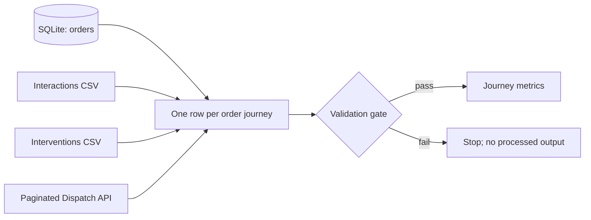

# FlashEats: where does delivery time build up?

## The decision

FlashEats leadership has heard that deliveries are late and ETAs are unreliable. Before investing in delay prediction, the team needs to know which part of the order journey is taking time and whether the available data is good enough to act on.

This project reconstructs one row per order, joins dispatch, customer interaction and intervention evidence, and reports a small set of delivery KPIs. It is an investigation on the supplied classroom dataset, not a claim about a live FlashEats operation.

## Who would use this

An operations lead can use the output to decide where to investigate first: restaurant preparation / pickup, or driver transit. A customer experience lead can compare late deliveries with customer contacts. These are diagnostic signals; they do not prove that any one factor caused lateness.

## What is in the data

| Source | Owner in this exercise | Grain | Retrieval and role |
|---|---|---|---|
| `database/flasheats.db` (`orders`, `customers`, `drivers`, `restaurants`) | Core operations | One row per entity; orders are the KPI grain | SQL / SQLite; order lifecycle and reference data |
| `data/customer_interactions.csv` | Customer support | One row per customer contact | CSV file; joins by `order_id` |
| `data/order_interventions.csv` | Dispatch operations | One row per intervention | CSV file; joins by `order_id` |
| `api/dispatch_data.json` via local mock API | Dispatch | One row per dispatch order | Paginated HTTP API; current ETA / driver assignment |

The source pack and starter pipeline structure are from the instructor's [FlashEats Class 8 teaching repository](https://github.com/manangupta12/flasheats-data-pipeline/tree/main/Class8_Project); the source inventory is described in [README_STUDENTS.md](https://github.com/manangupta12/flasheats-classroom-pack/blob/main/README_STUDENTS.md). My work here is the Track A framing, source-to-question map, KPI interpretation, evidence and readiness notes. The classroom API is intentionally controlled and includes retryable errors. Source data is included here so a run does not depend on a separate checkout.

## Workflow and source map



The model grain is one order. Interactions, interventions and dispatch rows are reduced or checked before joining to avoid multiplying orders. See [`docs/data_model.md`](docs/data_model.md) for the event model and metric definitions.

## Run it

Python 3.10+ is recommended.

```bash
python -m pip install -r requirements.txt
python run_pipeline.py --run-date 2026-09-27
```

The pipeline starts the local mock API, fetches every page, checks the API's reported total against retrieved rows, saves each raw response under `data/raw/dispatch/`, validates the inputs, builds the journey and writes partitioned outputs under `data/processed/run_date=2026-09-27/`. Logs go to `logs/`.

Run the same command again to replace the same run-date output safely. The `--chaos` option can demonstrate a missing column, duplicate order, or stale data failure; see [`TROUBLESHOOTING.md`](TROUBLESHOOTING.md).

## KPI definitions

The primary KPI is the late delivery rate: delivered orders with an actual delivery timestamp later than promised ETA divided by delivered orders with both timestamps. Supporting measures are median order-to-pickup minutes, median pickup-to-delivery minutes, and the share of orders with a recorded intervention. The generated `metrics.json` and `order_journey.csv` are the evidence table.

## What the evidence can and cannot say

**Known:** The supplied database and files are local classroom inputs. Pipeline results describe those records only. Duplicate order rows are flagged and the cleaning rule retains one row per order. The API is paginated and retrieval completeness is checked against its reported count.

**Assumptions:** `promised_eta` is the service commitment; `actual_delivery_at` is the completion time; positive difference means late. `order_id` is the shared join key. The latest source timestamp is expected within the configured freshness window.

**Unknown:** No live system owner has confirmed timestamp semantics, clock/time-zone conventions, or whether cancelled / undelivered orders belong in the service KPI. Dispatch current ETA is not historical ETA accuracy. Contact and intervention records may be incomplete.

**Limitation:** This dataset can show where recorded elapsed time accumulates and where records are missing or duplicated. It cannot establish that an intervention reduced delays or that any observed association is causal. A controlled pilot with reliable event timestamps would be needed before choosing an operational change.

## Submission files

- [`docs/assessment_summary.pdf`](docs/assessment_summary.pdf) - two-page assessment summary.
- [`docs/data_model.md`](docs/data_model.md) - source map, grain, events and definitions.
- [`docs/known_unknown_assumptions.md`](docs/known_unknown_assumptions.md) - readiness notes.

## Reference material

- [FlashEats classroom pack](https://github.com/manangupta12/flasheats-classroom-pack)
- [FlashEats Class 8 pipeline and data](https://github.com/manangupta12/flasheats-data-pipeline/tree/main/Class8_Project)
